# Skin Clinic

> 피부 타입 설문을 기반으로 사용자에게 맞춤 시술을 추천하고, 피부 진단 결과와 추천 이력을 확인할 수 있는 피부 클리닉 웹 서비스입니다.

본 프로젝트는 팀 프로젝트로 진행되었으며, 이 저장소는 제가 담당한 **피부 설문, 맞춤 시술 추천, 챗봇 상담, 알림, 마이페이지 일부 기능, 시술 만족도 평가 기능**을 중심으로 정리한 버전입니다.

<br />

## 프로젝트 소개

Skin Clinic은 사용자가 피부 타입, 피부 고민, 고민 부위, 추가 문진 정보를 입력하면 설문 결과를 분석하여 적합한 피부 관리 시술을 추천해주는 서비스입니다.

전체 서비스에는 회원 관리, 예약, 결제, 상담, 관리자 기능 등이 포함되어 있으며, 저는 그중 사용자 피부 데이터 수집부터 추천 결과 제공, 알림/상담, 마이페이지 이력 확인, 시술 만족도 평가까지 이어지는 기능을 담당했습니다.

<br />

## 프로젝트 화면

### 피부 설문

<p align="center">
  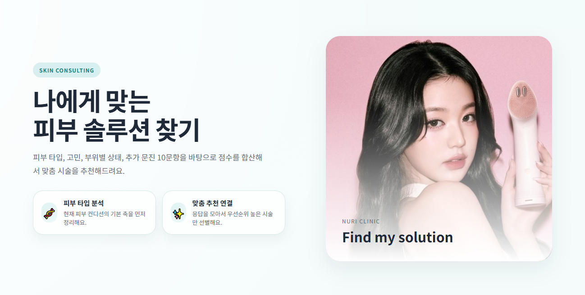
</p>

<p align="center">
  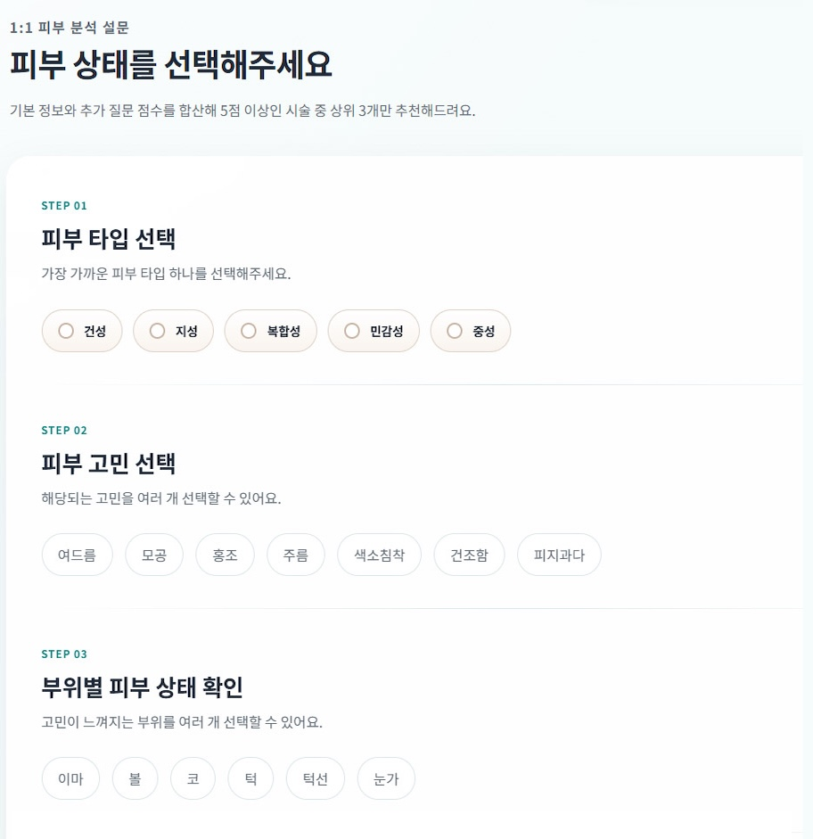
  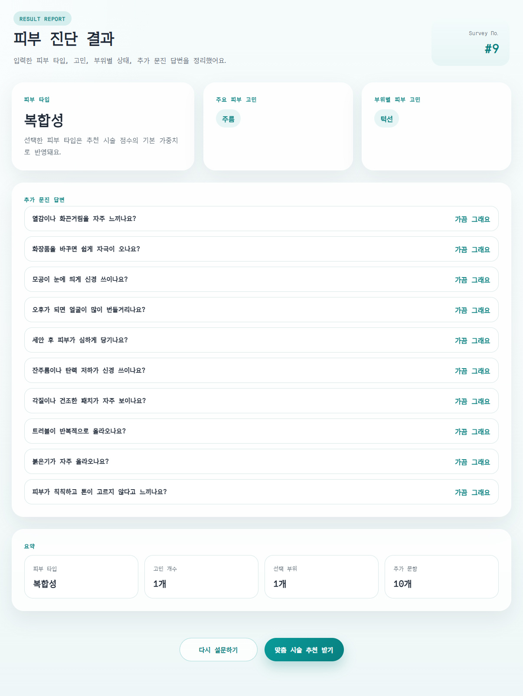
</p>

<br />

### 맞춤 시술 추천

<p align="center">
  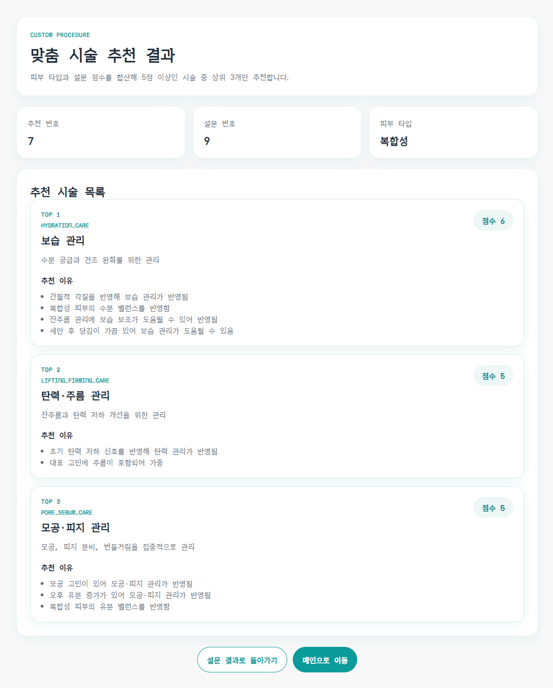
  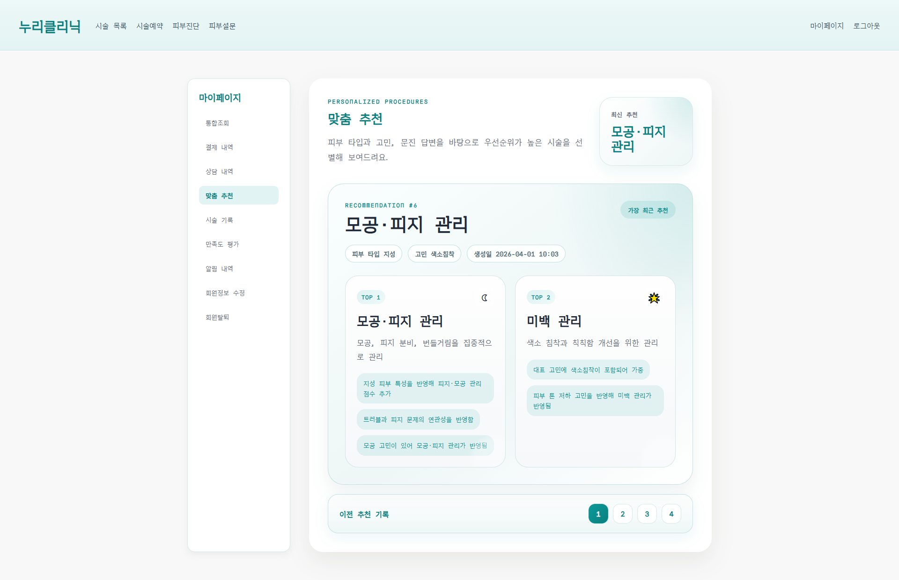
</p>

<br />

### 마이페이지

<p align="center">
  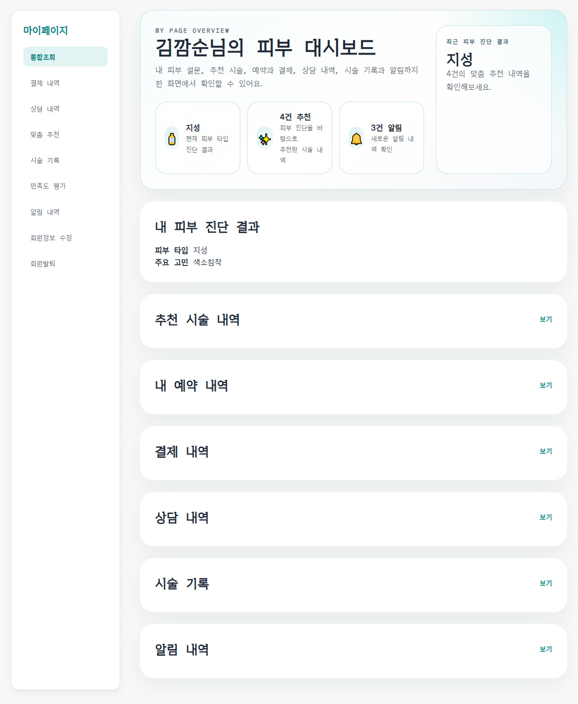
  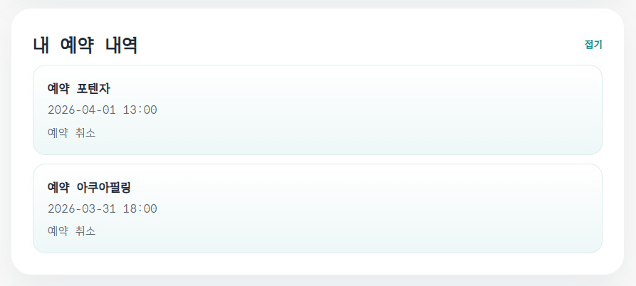
</p>

<br />

### 챗봇 상담

<p align="center">
  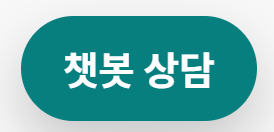
</p>

<p align="center">
  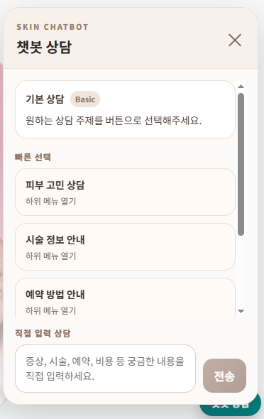
  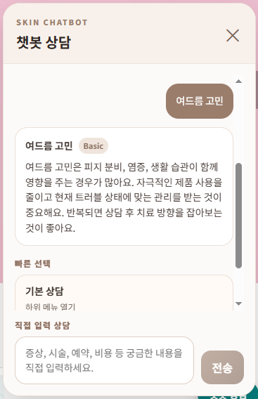
  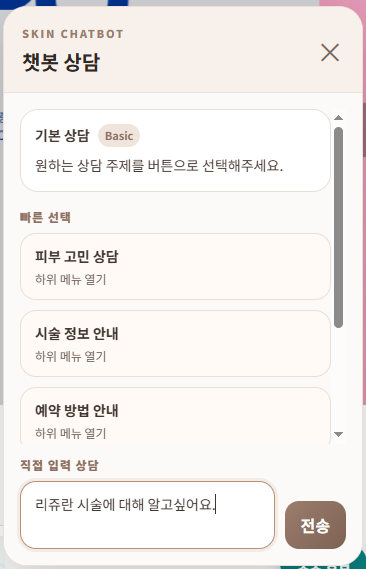
  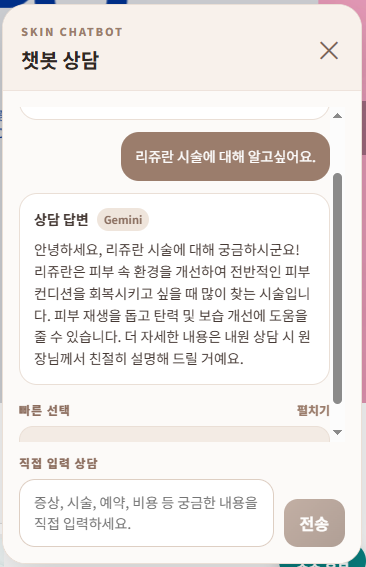
</p>

<br />

### 알림

<p align="center">
  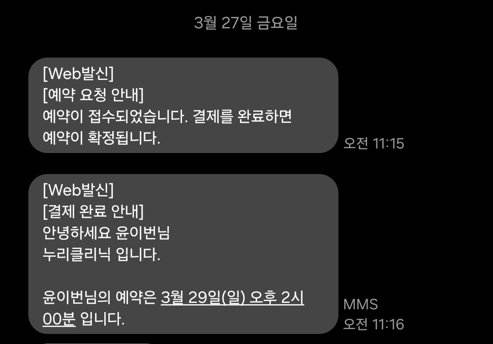
  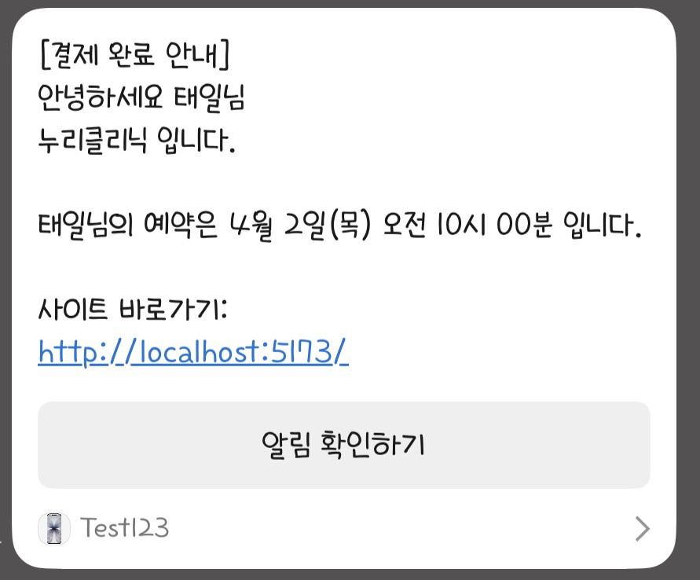
  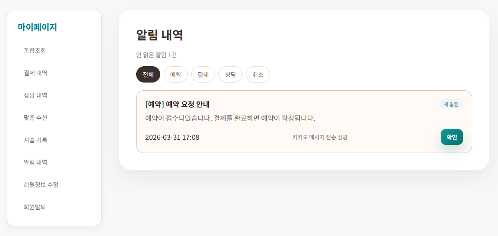
</p>

<br />

### 시술 만족도 평가

<p align="center">
  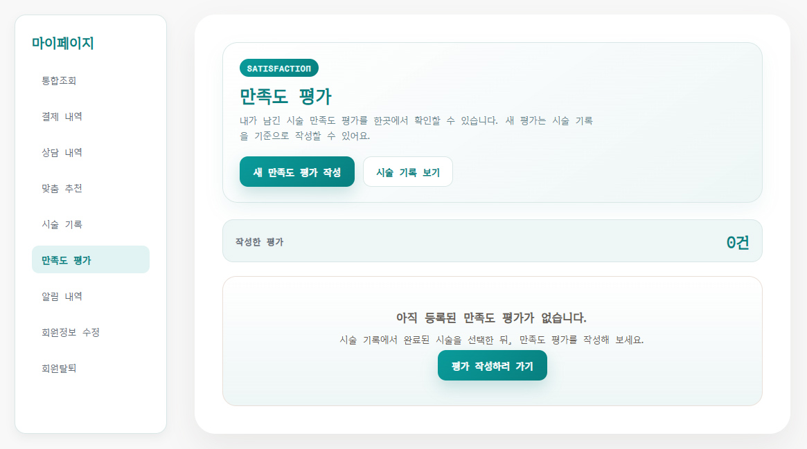
</p>

<p align="center">
  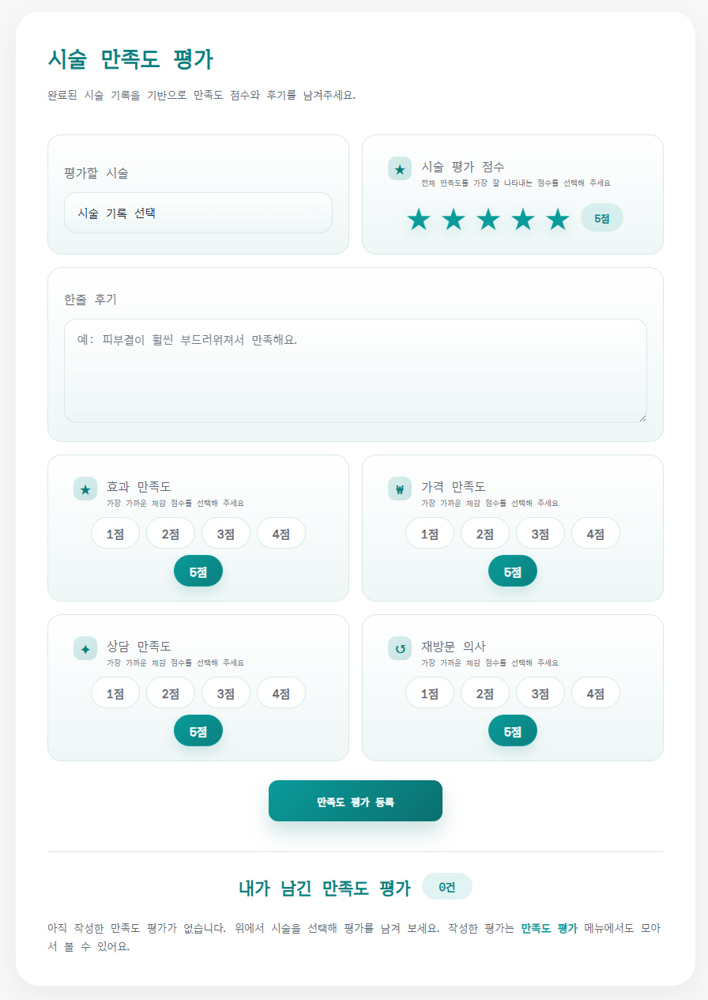
</p>

<p align="center">
  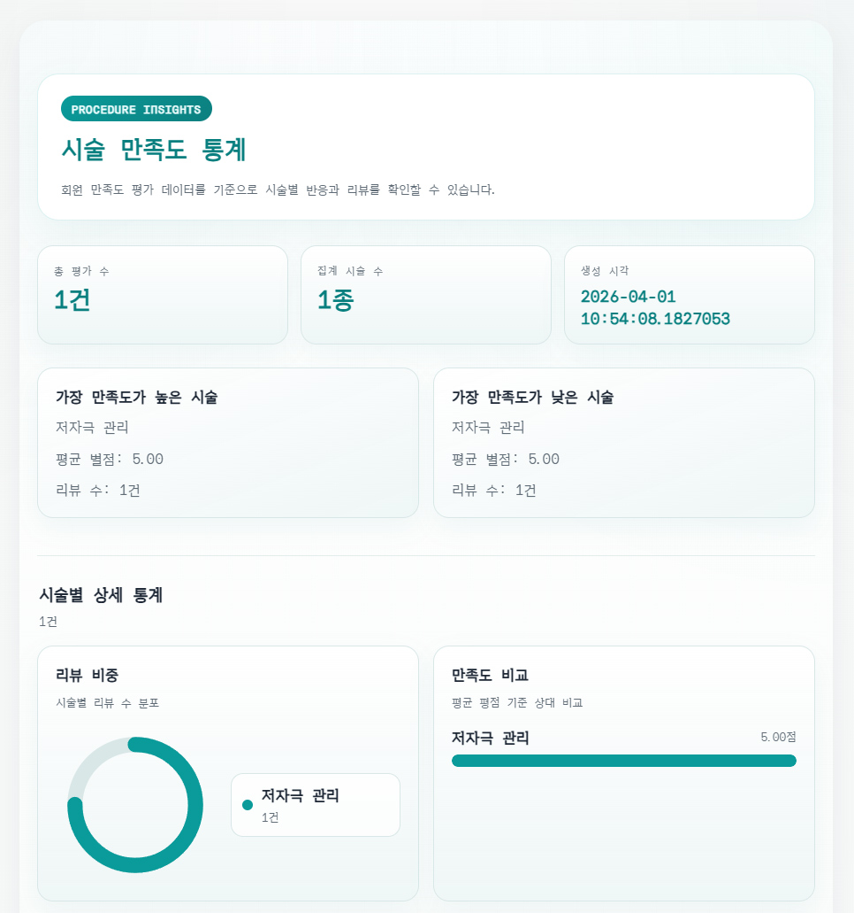
  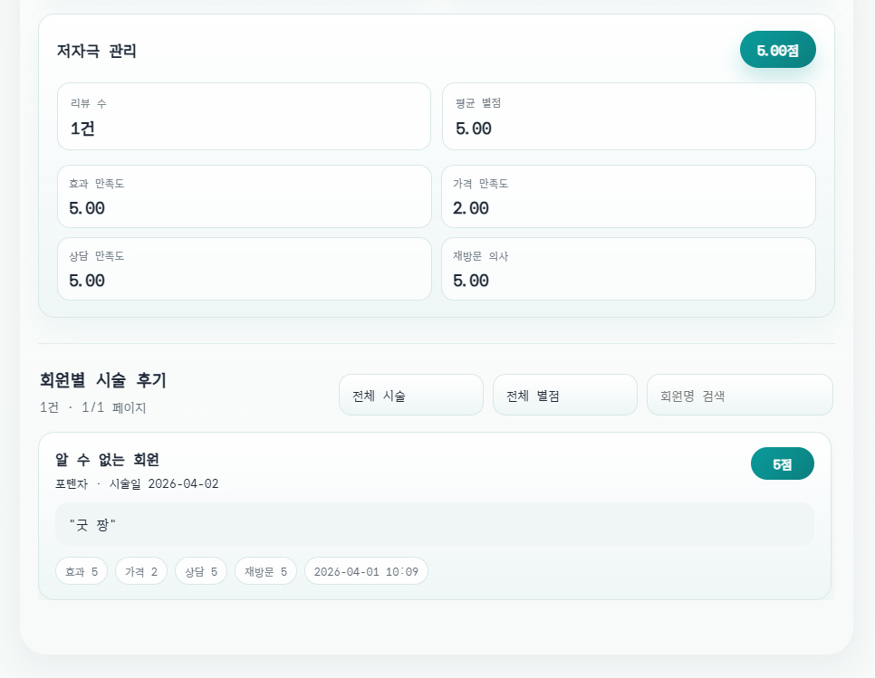
</p>

<br />

## 담당 역할 요약

- 사용자 피부 설문 및 분석 결과 화면 구현
- 피부 상태 기반 맞춤 시술 추천 기능 구현
- 결제, 예약 및 상담 관련 알림 기능 구현
- 사용자 편의 향상을 위한 챗봇 상담 기능 구현
- 마이페이지 내 정보 통합 조회 기능 구현
- 만족도 평가 수집 및 관리자 통계 확인 기능 구현
- 프론트엔드 배포 및 서비스 운영 반영

사용자 서비스 흐름과 직접 연결되는 기능들을 중심으로 담당했습니다.  
피부 설문, 맞춤 추천, 알림, 상담, 마이페이지, 만족도 평가가 서로 연계되도록 구현했습니다.  
React 프론트엔드는 정적 파일 형태이기 때문에 S3와 CloudFront를 활용해 배포했습니다.

<br />

## 담당 기능

### 피부 설문 기능

- 피부 타입 선택 UI 구현
- 피부 고민 복수 선택 UI 구현
- 고민 부위 선택 UI 구현
- 추가 피부 문진 10문항 응답 UI 구현
- 설문 데이터 저장 API 연동
- 설문 결과 단건 조회 API 연동
- 사용자별 최신 설문 결과 조회 API 연동
- 설문 완료 후 결과 페이지 이동 처리

### 맞춤 시술 추천 기능

- 피부 설문 결과 기반 추천 로직 구현
- 피부 고민별 추천 점수 반영
- 피부 타입별 추천 점수 반영
- 추가 문진 답변별 추천 점수 반영
- 동일 시술이 여러 조건에 해당할 경우 점수 합산
- 추천 점수 5점 이상인 시술 필터링
- 상위 3개 추천 시술 제공
- 추천 시술명, 설명, 점수, 추천 사유 반환
- 추천 결과 저장 및 추천 이력 조회 기능 구현

### 마이페이지 연동

- 마이페이지 내 피부 진단/설문 결과 조회 화면 구현
- 맞춤 추천 이력 조회 화면 구현
- 사용자의 최신 피부 설문 결과 기반 대시보드 구성
- 추천 결과 상세 페이지 이동 처리
- 시술 기록 및 만족도 평가 화면 연동

### 챗봇 상담 기능

- 챗봇 상담 UI 구현
- 피부 고민, 시술 정보, 예약 안내, FAQ 빠른 상담 메뉴 구성
- 버튼 선택 기반 상담 응답 처리
- 직접 입력 기반 상담 API 연동
- Gemini API를 활용한 자유 입력 답변 보완
- 관리자 상담 연결 필요 여부 안내 처리

### 알림 기능

- 사용자별 알림 목록 조회 기능 구현
- 읽지 않은 알림 개수 조회 기능 구현
- 알림 읽음 처리 기능 구현
- 관리자 알림 생성 기능 구현
- 관리자 전체 알림 조회 기능 구현
- 예약/결제/상담 이벤트 기반 알림 생성 흐름 구현
- 카카오 메시지 발송 실패 시 SMS 대체 발송 처리

### 시술 만족도 평가 기능

- 시술 완료 내역 기반 만족도 평가 대상 조회 기능 구현
- 사용자 시술 만족도 평가 및 한줄평 등록 기능 구현
- 사용자별 시술 리뷰 조회 기능 구현
- 관리자 전체 시술 리뷰 조회 기능 구현
- 관리자 시술 만족도 통계 확인 기능 구현

<br />

## 전체 서비스 주요 기능

팀 프로젝트 전체 서비스에는 아래 기능들이 포함되어 있습니다.

- 회원가입 / 로그인 / 카카오 OAuth 로그인
- 피부 설문 및 맞춤 시술 추천
- 피부 사진 진단
- 시술 목록 및 상세 조회
- 예약 및 결제
- 실시간 상담 및 챗봇 상담
- 마이페이지
- 알림
- 시술 만족도 평가 및 한줄평
- 관리자 회원/시술/예약/결제/상담/알림 관리
- 시술 만족도 통계

<br />

## 기술 스택

### Backend

`Java 21` `Spring Boot 3.5.11` `Spring Web` `Spring Data JPA` `Spring Security`  
`OAuth2 Client` `Validation` `WebSocket` `Lombok` `MySQL`  
`Java Mail` `Solapi SMS SDK` `Kakao API` `Gemini API`

### Frontend

`React 19` `Vite` `React Router DOM` `Axios` `CSS`

### Deployment

`AWS S3` `AWS CloudFront`

<br />

## 배포 경험

프론트엔드의 경우 Vite 기반 React 프로젝트를 정적 파일로 빌드한 뒤, AWS S3와 CloudFront를 활용해 배포했습니다.

React 프론트엔드는 빌드 후 HTML, CSS, JavaScript 정적 파일로 제공할 수 있기 때문에 S3에 업로드하고, CloudFront를 통해 CDN 기반으로 서비스되도록 구성했습니다.

다만 팀 프로젝트 진행 과정에서 백엔드 서버 배포가 완료되지 않아, 최종 동작 확인은 로컬 백엔드 서버와 연동하는 방식으로 진행했습니다.

<br />

## 배포 화면

### AWS S3 정적 파일 배포

<p align="center">
  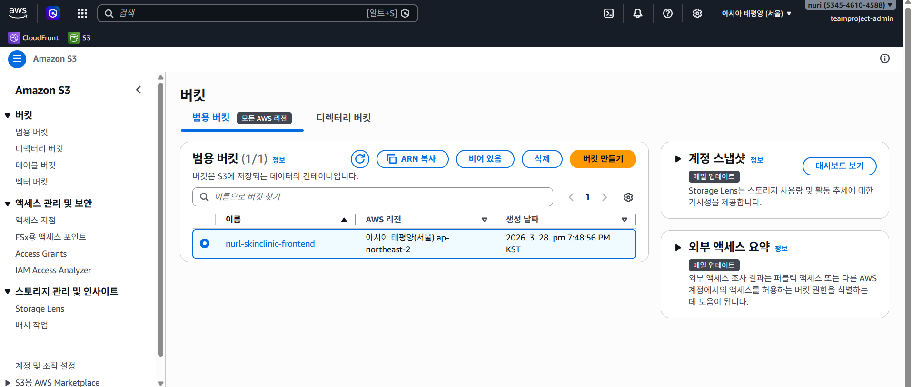
</p>

### CloudFront CDN 배포

<p align="center">
  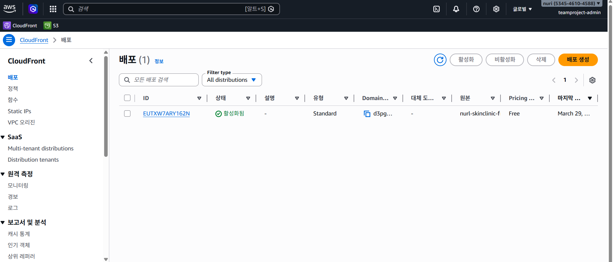
</p>

<br />

## 담당 기능 프로젝트 구조

```text
clinic
├── skinclinic-back
│   └── src/main/java/com/skinclinic
│       ├── domain
│       │   ├── consultation/chatbot
│       │   ├── notification
│       │   ├── procedure/review
│       │   └── skin
│       │       ├── survey
│       │       └── recommendation
│       └── global
│           ├── auth
│           ├── config
│           └── exception
│
└── skinclinic-react
    └── src
        ├── api
        │   ├── chatbotApi.js
        │   ├── notificationApi.js
        │   ├── procedureReviewApi.js
        │   ├── recommendationApi.js
        │   └── skinSurveyApi.js
        ├── constants
        │   └── skinSurveyOptions.js
        └── pages
            ├── admin
            ├── chatbot
            ├── mypage
            ├── recommendation
            └── skin-survey
```

<br />

## 주요 API

### 피부 설문

| Method | URL                                       | 설명                  |
| ------ | ----------------------------------------- | --------------------- |
| POST   | `/api/skin-surveys`                       | 피부 설문 저장        |
| GET    | `/api/skin-surveys/{id}`                  | 설문 단건 조회        |
| GET    | `/api/skin-surveys/me/latest`             | 내 최신 설문 조회     |
| GET    | `/api/skin-surveys/users/{userId}/latest` | 사용자 최신 설문 조회 |
| GET    | `/api/skin-surveys/users/{userId}`        | 사용자 설문 이력 조회 |

### 맞춤 추천

| Method | URL                                       | 설명                     |
| ------ | ----------------------------------------- | ------------------------ |
| POST   | `/api/recommendations`                    | 추천 결과 생성           |
| GET    | `/api/recommendations/{recommendationId}` | 추천 결과 상세 조회      |
| GET    | `/api/recommendations`                    | 전체 추천 이력 조회      |
| GET    | `/api/recommendations/users/{userId}`     | 사용자 추천 이력 조회    |
| GET    | `/api/recommendations/survey/{surveyId}`  | 설문 기준 추천 이력 조회 |

### 챗봇

| Method | URL                     | 설명                  |
| ------ | ----------------------- | --------------------- |
| GET    | `/api/chatbot/welcome`  | 챗봇 초기 메시지 조회 |
| POST   | `/api/chatbot/messages` | 챗봇 메시지 전송      |

### 알림

| Method | URL                                              | 설명                     |
| ------ | ------------------------------------------------ | ------------------------ |
| GET    | `/api/notifications/users/{userId}`              | 사용자 알림 조회         |
| GET    | `/api/notifications/users/{userId}/unread-count` | 읽지 않은 알림 개수 조회 |
| PATCH  | `/api/notifications/{notificationId}/read`       | 알림 읽음 처리           |
| POST   | `/api/notifications/me/test`                     | 내 알림 테스트 생성      |
| GET    | `/api/admin/notifications`                       | 관리자 전체 알림 조회    |
| GET    | `/api/admin/notifications/members`               | 알림 대상 회원 조회      |
| POST   | `/api/admin/notifications`                       | 관리자 알림 생성         |
| POST   | `/api/admin/notifications/events`                | 이벤트 기반 알림 생성    |

### 시술 만족도 평가

| Method | URL                                                | 설명                       |
| ------ | -------------------------------------------------- | -------------------------- |
| GET    | `/api/procedure-reviews/users/{userId}/candidates` | 만족도 평가 대상 조회      |
| GET    | `/api/procedure-reviews/users/{userId}`            | 사용자 시술 리뷰 조회      |
| POST   | `/api/procedure-reviews`                           | 시술 만족도 평가 등록      |
| GET    | `/api/admin/procedure-review-stats`                | 관리자 만족도 통계 조회    |
| GET    | `/api/admin/procedure-reviews`                     | 관리자 전체 시술 리뷰 조회 |

<br />

## 추천 로직 요약

사용자가 입력한 피부 설문 데이터는 다음 기준으로 점수화됩니다.

1. 피부 고민별 추천 점수 반영
2. 피부 타입별 추천 점수 반영
3. 추가 문진 10문항 응답에 따른 점수 반영
4. 동일 시술이 여러 조건에 해당하면 점수 합산
5. 총점 5점 이상인 시술만 추천 후보로 선정
6. 추천 후보 중 점수가 높은 상위 3개 시술 반환
7. 추천 시술명, 설명, 점수, 추천 사유 제공

추천 대상 시술 유형은 다음과 같습니다.

- 여드름 케어
- 진정 관리
- 모공·피지 관리
- 미백 관리
- 홍조 완화 관리
- 탄력·주름 관리
- 보습 관리
- 피부 장벽 관리
- 저자극 관리

<br />

## 실행 방법

### Backend

```bash
cd skinclinic-back
./gradlew bootRun
```

Backend 기본 주소:

```text
http://localhost:8080
```

### Frontend

```bash
cd skinclinic-react
npm install
npm run dev
```

Frontend 기본 주소:

```text
http://localhost:5173
```

<br />

## 환경 변수

실제 API Key, 비밀번호, 토큰 값은 GitHub에 올리지 않도록 주의해야 합니다.

```text
MAIL_USERNAME=
MAIL_PASSWORD=

KAKAO_OAUTH_CLIENT_ID=
KAKAO_OAUTH_CLIENT_SECRET=
KAKAO_REST_API_KEY=
KAKAO_CLIENT_SECRET=

SOLAPI_API_KEY=
SOLAPI_API_SECRET=
SOLAPI_SENDER_NUMBER=

GEMINI_CHAT_API_KEY=
GEMINI_VISION_API_KEY=
```

<br />

## 구현하며 고려한 점

- 설문 입력값을 단순 저장하는 데서 끝내지 않고, 추천 로직과 연결되도록 데이터 구조를 설계했습니다.
- 피부 고민, 피부 타입, 추가 문진 답변을 각각 점수화하여 추천 결과의 근거를 만들었습니다.
- 추천 결과에 점수뿐 아니라 추천 사유를 함께 제공하여 사용자가 왜 해당 시술을 추천받았는지 이해할 수 있도록 했습니다.
- 챗봇은 버튼 기반 상담과 자유 입력 상담을 함께 지원하여 사용 편의성을 높였습니다.
- 알림 기능은 단순 목록 조회뿐 아니라 읽음 처리, 관리자 알림 생성, 카카오/SMS 발송 흐름까지 고려했습니다.
- 시술 만족도 평가는 사용자 한줄평 수집과 관리자 통계 확인이 가능하도록 구성했습니다.
- 프론트엔드 배포 과정에서 React 빌드 결과물을 정적 파일로 제공하고, S3와 CloudFront를 활용해 배포하는 흐름을 경험했습니다.

<br />

## 기대 효과

- 사용자는 설문을 통해 자신의 피부 상태에 맞는 시술을 추천받을 수 있습니다.
- 추천 결과와 피부 진단 이력을 마이페이지에서 다시 확인할 수 있습니다.
- 챗봇을 통해 피부 고민과 시술 정보를 빠르게 확인할 수 있습니다.
- 만족도 평가를 통해 사용자의 시술 경험을 수집하고, 관리자는 통계로 서비스 품질을 확인할 수 있습니다.
- 관리자는 알림을 통해 사용자에게 예약, 결제, 상담 관련 안내를 전달할 수 있습니다.
